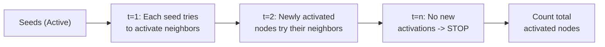

# Influence Maximization Complete Walkthrough

> **Course**: COL761 - Data Mining, at IIT Delhi
> This document explains the solution in `src/solution.cpp`, how it solves the influence maximization problem, and the mathematical intuition behind each design choice. Repository-specific details are sourced from [`src/solution.cpp`](src/solution.cpp), [`solution.sh`](solution.sh).

---

## Table of Contents

1. [Assignment Overview](#1-assignment-overview)
2. [Repository Structure](#2-repository-structure)
3. [Problem Formulation](#3-problem-formulation)
   - [3.1 Problem Statement](#31-problem-statement)
   - [3.2 Mathematical Background: Influence Maximization](#32-mathematical-background-influence-maximization)
   - [3.3 The Independent Cascade Model](#33-the-independent-cascade-model)
   - [3.4 Why Greedy Works: Submodularity](#34-why-greedy-works-submodularity)
4. [Solution Architecture](#4-solution-architecture)
   - [4.1 Data Structures](#41-data-structures)
   - [4.2 Graph Loading: `loadGraph()`](#42-graph-loading-loadgraph)
   - [4.3 Monte Carlo Simulation: `simulateSpread()`](#43-monte-carlo-simulation-simulatespread)
   - [4.4 Greedy Seed Selection: `chooseBestNode()`](#44-greedy-seed-selection-choosebestnode)
   - [4.5 Infection-Based Pruning: `removeInfectedNodes()`](#45-infection-based-pruning-removeinfectednodes)
   - [4.6 Main Driver: `main()`](#46-main-driver-main)
5. [Key Optimizations](#5-key-optimizations)
6. [Hyperparameters](#6-hyperparameters)
7. [End-to-End Execution Flow](#7-end-to-end-execution-flow)
8. [Sources](#8-sources)

---

## 1. Assignment Overview

The assignment requires solving the **Influence Maximization** problem on a directed, weighted social network graph. Given a graph of users and their influence probabilities along edges, the goal is to select a set of `k` **seed nodes** that maximizes the total number of nodes influenced (expected spread) under the **Independent Cascade (IC)** diffusion model. This framing follows the assignment specification and the influence maximization formulation of [Kempe, Kleinberg, and Tardos](https://toc.cs.uchicago.edu/articles/v011a004/).

| Aspect | Details |
|--------|---------|
| **Task** | Select k seed nodes to maximize influence spread |
| **Graph Type** | Directed, weighted (edge weights = propagation probabilities) |
| **Diffusion Model** | Independent Cascade |
| **Algorithm** | Greedy with Monte Carlo simulation + node pruning |
| **Language** | C++ (compiled with `-O3` optimization) |

---

## 2. Repository Structure

```
hw2/
├── COL761_HW2.pdf        # Assignment specification
├── report.pdf            # Submitted report
├── solution.sh           # Shell wrapper: compiles and runs solution
└── src/
    └── solution.cpp      # Complete C++ solution
```

**Shell script** (`solution.sh`):
```bash
g++ -std=c++11 -O3 -o solution src/solution.cpp
./solution "$1" "$2" "$3" "$4"
```
Usage: `bash solution.sh <graph_file> <output_file> <k> <random_instances>`

---

## 3. Problem Formulation

### 3.1 Problem Statement

> **Given**: A directed graph `G = (V, E)` where each edge `(u, v) ∈ E` has a propagation probability `p(u,v) ∈ [0, 1]`, and an integer `k`.
>
> **Goal**: Find a seed set `S ⊆ V` with `|S| = k` that maximizes the **expected influence spread** `σ(S)` under the Independent Cascade model.

Formally:

```
S* = argmax_{S ⊆ V, |S| = k}  σ(S)
```

where `σ(S) = 𝔼[|I(S)|]` and `I(S)` is the set of all nodes eventually activated starting from seed set `S`.

### 3.2 Mathematical Background: Influence Maximization

Influence Maximization was introduced by [Kempe, Kleinberg, and Tardos](https://toc.cs.uchicago.edu/articles/v011a004/) in their KDD 2003 work. The key results are:

1. **NP-Hardness**: Computing the optimal seed set is NP-hard under the IC model.
2. **Submodularity**: The influence function `σ(S)` is a **monotone submodular** function:
   - **Monotone**: Adding more seeds never decreases spread: `σ(S ∪ {v}) ≥ σ(S)`
   - **Submodular** (diminishing returns): `σ(S ∪ {v}) - σ(S) ≥ σ(T ∪ {v}) - σ(T)` for `S ⊆ T`
3. **Greedy Guarantee**: A simple greedy algorithm achieves a `(1 - 1/e) ≈ 63.2%` approximation ratio for monotone submodular maximization under a cardinality constraint, following the result of [Nemhauser, Wolsey, and Fisher](https://ideas.repec.org/p/cor/louvrp/334.html).

### 3.3 The Independent Cascade Model

The IC model is a stochastic diffusion process, as described in the influence maximization literature by [Kempe, Kleinberg, and Tardos](https://toc.cs.uchicago.edu/articles/v011a004/):

1. **Initialization**: At time `t = 0`, all seed nodes in `S` are "active" (infected).
2. **Propagation**: At each timestep `t`, every **newly activated** node `u` gets a **single chance** to activate each of its inactive neighbors `v` with probability `p(u,v)`.
3. **Termination**: The process ends when no new activations occur.



> [!IMPORTANT]
> Each active node gets **exactly one chance** to influence each neighbor. Once it has tried (and either succeeded or failed), it does not try again. This makes the process a **BFS-like stochastic cascade** through the network.

### 3.4 Why Greedy Works: Submodularity

The greedy algorithm iteratively picks the node with the highest **marginal gain**:

```
For i = 1, 2, ..., k:
    s_i = argmax_{v ∈ V \ S_{i-1}}  [σ(S_{i-1} ∪ {v}) - σ(S_{i-1})]
    S_i = S_{i-1} ∪ {s_i}
```

By [Nemhauser, Wolsey, and Fisher](https://ideas.repec.org/p/cor/louvrp/334.html), for any monotone submodular function maximization under a cardinality constraint:

```
σ(S_greedy) ≥ (1 - 1/e) · σ(S*)
```

This `63.2%` approximation guarantee is the classical theoretical basis for the greedy approach.

---

## 4. Solution Architecture

### 4.1 Data Structures

```cpp
struct Graph {
    int n;                                          // Number of nodes
    vector<vector<pair<int, double>>> adj;           // Adjacency list: adj[u] = [(v, p), ...]
};

map<int, int> id2node, node2id;                      // Bidirectional node ID mapping
```

- **`Graph`**: Stores the directed graph as an adjacency list. Each entry `adj[u]` contains pairs `(v, p)` meaning node `u` can influence node `v` with probability `p`.
- **`node2id` / `id2node`**: Maps between original node IDs (which may be arbitrary integers) and contiguous internal IDs `[0, n-1]`. This enables array-based lookup instead of hash-map-based, which is crucial for performance.

### 4.2 Graph Loading: `loadGraph()`

```cpp
Graph loadGraph(const string &filename) {
    // Read edges as (u, v, p) triplets
    while (fin >> u >> v >> p) {
        // Assign contiguous IDs
        if (node2id.find(u) == node2id.end()) {
            node2id[u] = maxNode;
            id2node[maxNode] = u;
            maxNode++;
        }
        // ... same for v
        edges.push_back(make_tuple(u_id, v_id, p));
    }
    // Build adjacency list
    for (auto &edge : edges) {
        g.adj[u_id].push_back({v_id, p});
    }
}
```

**Key detail**: The graph size is set to `maxNode + 1` after reading all edges. Node ID remapping ensures that even if the input file has non-contiguous node IDs (e.g., `{5, 100, 2003}`), the internal representation uses compact indices for efficient array access.

> [!NOTE]
> The graph is stored as a **directed** adjacency list. Edge `(u, v, p)` means `u → v` with probability `p`. There is no reverse edge added, so influence propagates only in the direction specified by the input.

### 4.3 Monte Carlo Simulation: `simulateSpread()`

Since computing `σ(S)` exactly is **#P-hard** for the IC model, the standard approach is **Monte Carlo estimation**: simulate the IC process many times and average the spread. This hardness and the use of scalable estimation are discussed by [Wang, Chen, and Wang](https://www.microsoft.com/en-us/research/publication/scalable-influence-maximization-for-independent-cascade-model-in-large-scale-social-networks/).

```cpp
double simulateSpread(int start, const Graph &g, const vector<bool>& removed,
                      vector<double>& probCounts, int random_instances, mt19937 &rng) {
    for (int instance = 0; instance < random_instances; instance++) {
        // BFS-based IC simulation from 'start'
        visited[start] = true;
        q.push(start);
        while (!q.empty()) {
            int u_id = q.front(); q.pop();
            for (auto &edge : g.adj[u_id]) {
                if (removed[v_id] || visited[v_id]) continue;
                if (dist(rng) <= p) {              // Coin flip with probability p
                    visited[v_id] = true;
                    q.push(v_id);
                }
            }
        }
        // Count total infected nodes
        totalSpread += spread;
        infectionCount[i]++;  // Per-node infection tally
    }
    // Compute per-node infection probability
    probCounts[i] = infectionCount[i] / random_instances;
    return totalSpread / random_instances;
}
```

#### Mathematical Formulation

For a seed node `s`, the estimated expected spread after `R` simulations is:

```
σ̂({s}) = (1/R) · Σᵢ₌₁ᴿ |I_i(s)|
```

where `I_i(s)` is the set of activated nodes in the `i`-th simulation. By the law of large numbers, `σ̂ → σ` as `R → ∞`.

The function also produces **per-node infection probabilities**:

```
P̂(v | s) = (number of simulations where v was activated) / R
```

These probabilities are used for the pruning heuristic (Section 4.5).

#### Implementation Details

| Optimization | Description |
|-------------|-------------|
| **Pre-allocated `visited` buffer** | The `visited` vector is allocated once and reset with `fill()` each iteration, avoiding `O(n)` allocation overhead per simulation |
| **Queue reuse** | The `queue<int>` is cleared by reassignment rather than element-by-element popping |
| **Removed nodes skipped** | Nodes in the `removed` set are never visited, reducing BFS frontier size |
| **`mt19937` RNG** | Uses the C++ Mersenne Twister engine, as documented by [cppreference](https://en.cppreference.com/w/cpp/numeric/random/mersenne_twister_engine), since many random draws are needed |

### 4.4 Greedy Seed Selection: `chooseBestNode()`

```cpp
int chooseBestNode(const Graph &g, const vector<bool>& removed, int random_instances,
                   vector<double>& bestProbabilities, mt19937 &rng, double &bestSpread) {
    for (int node = 0; node < g.n; node++) {
        if (removed[node]) continue;
        double spread = simulateSpread(node, g, removed, tempProbabilities, random_instances, rng);
        if (spread > tempSpread) {
            bestNode = node;
            bestProbabilities = tempProbabilities;
        }
    }
    return bestNode;
}
```

This implements the **inner loop of the greedy algorithm**: for each candidate node (not yet removed), simulate its spread and pick the one with the highest expected influence.

#### Complexity Analysis

- **Per call**: `O(|V_remaining| · R · |E|)` where `R` = number of MC simulations
- **Total** (k iterations): `O(k · |V_remaining| · R · |E|)`

> [!WARNING]
> This is the computational bottleneck. Without pruning, `|V_remaining|` stays at `|V|` for all `k` iterations. The pruning heuristic (next section) dramatically reduces `|V_remaining|` after each iteration.

### 4.5 Infection-Based Pruning: `removeInfectedNodes()`

This is the **key heuristic** that accelerates the greedy algorithm beyond the standard approach:

```cpp
void removeInfectedNodes(const vector<double>& infectionProbabilities, double threshold,
                         vector<bool>& removed, int bestNode) {
    for (size_t i = 0; i < infectionProbabilities.size(); i++) {
        if (infectionProbabilities[i] > threshold || (int)i == bestNode)
            removed[i] = true;
    }
}
```

#### Intuition

After selecting a seed node `s`, any node `v` with high infection probability `P̂(v | s) > τ` is:
1. **Already well-covered** by `s`: selecting `v` as a future seed would have diminishing marginal gain.
2. **Structurally close** to `s`: removing `v` from the candidate set avoids wasting seeds on overlapping influence regions.

This is a form of **coverage-based pruning**: once a region of the graph is "sufficiently covered" by a selected seed, nodes in that region are excluded from future consideration.

#### Why This Works

Consider the marginal gain of adding node `v` to seed set `S`:

```
Δ(v | S) = σ(S ∪ {v}) - σ(S)
```

If `P̂(v | s) > τ`, it means `v` is already frequently activated by seed `s`. Therefore:
- `v`'s own neighborhood is likely already covered by the cascade from `s`
- The marginal contribution `Δ(v | S)` is expected to be low
- Removing `v` from the candidate set has minimal impact on solution quality

> [!TIP]
> The threshold `τ = 0.06` is hardcoded in [`src/solution.cpp`](src/solution.cpp), whose comment records it as a value obtained through hyperparameter tuning on the provided datasets. This is quite low, meaning nodes with even a 6% chance of being infected by an existing seed are excluded. This aggressively prunes the candidate set, trading a small amount of solution quality for significant speedup.

### 4.6 Main Driver: `main()`

```cpp
int main(int argc, char* argv[]) {
    // Parse: <graph_file> <output_file> <k> <random_instances>
    Graph g = loadGraph(graphFile);
    vector<bool> removed(g.n, false);

    for (int i = 0; i < k; i++) {
        // 1. Find the node with maximum expected spread
        int bestNodeId = chooseBestNode(g, removed, random_instances, bestProbabilities, rng, bestSpread);

        // 2. Write selected node to output (original ID)
        fout << id2node[bestNodeId] << "\n";
        fout.flush();

        // 3. Prune nodes likely infected by this seed
        removeInfectedNodes(bestProbabilities, infectivityThreshold, removed, bestNodeId);
    }
}
```

The `fout.flush()` after each node ensures **incremental output**, which is useful for debugging and for systems that monitor output in real time.

---

## 5. Key Optimizations

| Optimization | Impact | Description |
|-------------|--------|-------------|
| **Compile with `-O3`** | Optimized build | Uses the compile flag in [`solution.sh`](solution.sh) |
| **Contiguous ID remapping** | Constant-time lookup | Replaces hash-map lookups with array indexing |
| **Pre-allocated buffers** | Eliminates allocation churn | `visited` and `queue` reused across simulations |
| **Infection-based pruning** | Dramatically reduces candidate set | After each seed selection, removes nodes with >6% infection probability |
| **Hardcoded `random_instances = 100`** | Fixed simulation budget | Overrides CLI argument; balances accuracy vs. speed |
| **`mt19937` RNG** | Standard C++ Mersenne Twister engine | Used for the Monte Carlo draws |

> [!NOTE]
> The `random_instances` variable is **hardcoded to 100** in [`src/solution.cpp`](src/solution.cpp), ignoring the command-line argument `argv[4]`. This is a deliberate tuning choice: 100 simulations provide a reasonable trade-off between estimation accuracy and runtime. Increasing this value improves spread estimation but linearly increases computation time.

---

## 6. Hyperparameters

| Parameter | Value | Tuning Strategy |
|-----------|-------|----------------|
| `random_instances` | 100 | Hardcoded; balances accuracy and speed |
| `infectivityThreshold` | 0.06 | Tuned on the two provided datasets |

---

## 7. End-to-End Execution Flow


### Algorithm Pseudocode

```
INFLUENCE-MAXIMIZATION(G, k, R, τ):
    S ← ∅
    removed ← {false}^|V|
    
    for i = 1 to k:
        best_node ← null
        best_spread ← -∞
        
        for each v ∈ V where removed[v] = false:
            spread, probs ← MONTE-CARLO-BFS(v, G, removed, R)
            if spread > best_spread:
                best_node ← v
                best_spread ← spread
                best_probs ← probs
        
        S ← S ∪ {best_node}
        OUTPUT best_node
        
        for each v ∈ V:
            if best_probs[v] > τ or v = best_node:
                removed[v] ← true
    
    return S
```

### Command-Line Usage

```bash
# Compile and run
bash solution.sh <graph_file> <output_file> <k> <random_instances>

# Example
bash solution.sh network.txt seeds.txt 10 100
```

**Input format** (`graph_file`): Each line contains `u v p` where `u → v` has propagation probability `p`.

**Output format** (`output_file`): One seed node per line (original IDs).

---

> **Summary**: The solution uses a **greedy algorithm with Monte Carlo simulation** to solve the Influence Maximization problem under the Independent Cascade model. The key innovation is an **infection-based pruning heuristic** that removes nodes likely already covered by selected seeds, dramatically reducing the candidate set size and enabling faster greedy iterations. The `(1 - 1/e)` approximation guarantee of greedy for submodular functions provides a theoretical foundation, while the pruning trades a small amount of optimality for significant practical speedup.

## 8. Sources

- [`src/solution.cpp`](src/solution.cpp): graph loading, IC simulation, greedy seed selection, pruning, hardcoded simulation count, and pruning threshold.
- [`solution.sh`](solution.sh): compile and run commands.
- [Kempe, Kleinberg, and Tardos, "Maximizing the Spread of Influence through a Social Network"](https://toc.cs.uchicago.edu/articles/v011a004/): influence maximization, the Independent Cascade model, NP-hardness, submodularity, and the greedy approximation framing.
- [Nemhauser, Wolsey, and Fisher, "An analysis of approximations for maximizing submodular set functions - I"](https://ideas.repec.org/p/cor/louvrp/334.html): the greedy approximation guarantee for monotone submodular maximization under a cardinality constraint.
- [Wang, Chen, and Wang, "Scalable Influence Maximization for Independent Cascade Model in Large-Scale Social Networks"](https://www.microsoft.com/en-us/research/publication/scalable-influence-maximization-for-independent-cascade-model-in-large-scale-social-networks/): exact influence-spread hardness and scalable IC-model estimation context.
- [cppreference, `std::mersenne_twister_engine`](https://en.cppreference.com/w/cpp/numeric/random/mersenne_twister_engine): `std::mt19937` as the C++ Mersenne Twister engine.
